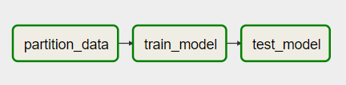
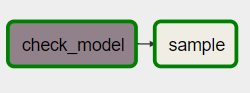
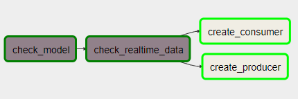

# TP Final Seminario de Tópicos Avanzados

## Alumno: Rodrigo Carlos Fondato
### ITBA - Enero 2023

<br/>
<br/>

El tópico elegido es **"Human Activity Recognition"**.

Se posee un dataset que fue obtenido mediante la utilización de una app (Actitracker) instalada en los celulares de varios usuarios que realizaron diversas actividades, registrando mediciones de los acelerómetros de los móviles en los ejes x,y,z con una frecuencia de 20hz, es decir, 20 mediciones por segundo. Con éste dataset se intentará (entre otras cosas), la creación de un modelo que permita predecir qué actividad estaba realizando un usuario en un intervalo de tiempo determinado, basado en las mediciones de éstos 3 sensores.

El dataset se divide en una porción etiquetada (los usuarios utilizaron un modo "Training", en el cual pudieron especificar la actividad que estaban realizando en cada momento), y una porción 10 veces mayor de datos no etiquetados (los usuarios simplemente se instalaron y utilizaron la aplicación, sin especificar sus acciones).

Los objetivos del trabajo son:
* Construir con docker-compose un stack de datos conformado por contenedores que simulen un sistema productivo de procesamiento distribudo, con nodos que se relacionarán entre sí para cumplir con el objetivo de explorar y explotar los datos descritos.
* Realizar un análisis exploratorio de los datos utilizando jupyter notebook (pyspark + seaborn).
* Utilizar spark (pyspark) con nodos master y workers, como base para el procesamiento distribuido de los diversos pasos que componen el stack de datos.
* Utilizar airflow como orquestador de procesos, y realizar workflows de procesamiento, entrenamiento y testeo periódico de modelos de machine learning, y la utilización de los mismos para la predicción de nuevos datos entrantes.
* Simular un stream entrante de datos de mediciones de nuevos usuarios, que serán publicados a un tópico de kafka y consumidos por otro contenedor que realizará predicciones en tiempo real y las almacenará en una carpeta.
* Utilizar un contenedor de mlflow para registrar cada modelo y sus correspondientes mediciones de accuracy, precision y recall obtenidas durante el testeo.

## Dataset:
------
<br/>

WISDM's Actitracker activity prediction data set v2.0, actualizado al: Oct. 22, 2013

El dataset fue publicado por el [Wireless Sensor Data Mining
(WISDM) Lab](http://www.cis.fordham.edu/wisdm/)

Obtenido del siguiente [enlace](https://www.cis.fordham.edu/wisdm/includes/datasets/latest/WISDM_at_latest.tar.gz)

Como fue solicitado por los autores, se cita el siguiente paper, en el cual se describe el proceso de recolección de los datos etiquetados y no etiquetados, además de un proceso de transformación para la realización de predicciones (que no se ha utilizado en éste trabajo):

>Jeffrey W. Lockhart, Gary M. Weiss, Jack C. Xue, Shaun T. Gallagher, 
>Andrew B. Grosner, and Tony T. Pulickal (2011). "Design Considerations
>for the WISDM Smart Phone-Based Sensor Mining Architecture," Proceedings 
>of the Fifth International Workshop on Knowledge Discovery from Sensor 
>Data (at KDD-11), San Diego, CA. 
><http://www.cis.fordham.edu/wisdm/public_files/Lockhart-Design-SensorKDD11.pdf>

El dataset se divide en los siguientes archivos:
* **WISDM_at_v2.0_raw.txt** => CSV que contiene las mediciones etiquetadas
  * Schema: [user], [activity], [timestamp], [x], [y], [z]
    * user: Id del usuario que realizó la actividad.
    * activity: Un label que representa la actividad realizada. Las opciones posibles son: 
        * Walking (Caminando)
        * Jogging (Trotando)
        * Sitting (Sentándose)
        * Standing (Estando de pie)
        * Upstairs (Subiendo escaleras)
        * Downstairs (Bajando escaleras)
    * timestamp: Es un valor entero que determina el unix epoch time en milisegundos.
    * x, y, z: Valores de los acelerómetros en los ejes x, y, z. Son valores reales entre -20 y +20, según la documentación.
* **WISDM_at_v2.0_raw_about.txt** => Contiene información sobre el dataset WISDM_at_v2.0_raw.txt
* **WISDM_at_v2.0_demographics.txt** => Contiene información demográfica de cada usuario, como altura, sexo, edad, peso, etc. Como se verá en el EDA, éste archivo se descarta porque contiene información de muy pocos usuarios y por lo tanto los valores serán null para la mayoría de los registros (no sirve para el entrenamiento).
* **WISDM_at_v2.0_unlabeled_raw.txt** => Similar a WISDM_at_v2.0_raw.txt pero con datos no etiquetados (activity es siempre "No Label")
* **WISDM_at_v2.0_unlabeled_raw_about.txt** => Contiene información sobre el dataset WISDM_at_v2.0_unlabeled_raw.txt
* Los archivos que poseen **_transformed** en el nombre corresponden al preprocesamiento realizado en el paper mencionado, pero no fueron utilizados para éste trabajo.

## Instalación:
------
<br/>

* Clonar éste repositorio: 
```bash
    git clone https://github.com/rfondato/seminario_topicos.git <destino>
```
* Descargar el [dataset](https://www.cis.fordham.edu/wisdm/includes/datasets/latest/WISDM_at_latest.tar.gz) y descomprimirlo en la carpeta **data**
* Correr el siguiente comando en la raíz del repositorio, que se encargará de crear nuevas imágenes de docker (con el prefijo rfondato/) necesarias para crear los contenedores:
```bash
    ./control_env.sh create-images
```
* Inicializar los contenedores utilizando el siguiente comando:
```bash
    ./control_env.sh start
```

**Importante!:** Se recomienda reservar al menos 10GB de RAM y 8 núcleos para el correcto funcionamiento de todos los contenedores. Por ejemplo, en el caso de utilizar WSL, reservar ésta cantidad de recursos desde el archivo .wslconfig.

## Contenedores:
------
<br/>

Se utilizaron como base las imágenes y archivos docker-compose.yml y control-env.sh de la materia, realizando algunas modificaciones a cada uno (por ejemplo: creando nuevas imágenes con diferentes versiones de spark y java, agregando nuevos contenedores como mlflow y el nuevo comando create-images a control-env.sh)

* **master:** Nodo master de spark.
    * Los submits se realizan a **spark://master:7077**
    * En **localhost:8080** se podrá visualizar el estado de cada worker.
* **worker1, worker2:** Nodos worker de spark. Se reservan 3 GB de ram y 3 núcleos para cada worker.
* **jupyter:** Nodo que corre spark en forma local + jupyter, para la ejecución de las notebooks que se encuentren en el directorio /notebook
    * En particular se encontrará una sola notebook eda.ipynb con el análisis de datos del dataset.
    * Se podrá acceder a jupyter mediante **localhost:8888**
    * Para acceder a una version ya renderizada de la notebook, acceder [acá](https://github.com/rfondato/seminario_topicos/blob/main/notebook/eda.ipynb)
* **postgres-airflow:** Contenedor que posee una DB postgres para almacenar los datos correspondientes a ejecuciones de DAGs de airflow.
* **airflow:** Contenedor con servidor de airflow, el webserver puede ser accedido mediante **localhost:9090**
* **mlflow:** Contenedor con servidor local de mlflow, utilizado para registrar los experimentos y modelos. Se puede acceder a la UI mediante **localhost:5000**
* **kafka** Contenedor utilizado para crear, publicar y consumir tópicos de kafka, en el puerto **9092**.

## DAGs:
------
<br/>

Se crean los siguientes 3 DAGs:

### **Train Model (/airflow/dags/train_model_dag.py):**

Este DAG se utiliza para el entrenamiento, testeo y publicación de los modelos (a mlFlow) en forma periódica. Corre diariamente a las 0hs, y posee la siguiente estructura:



* **partition_data:** BashOperator. Realiza un submit al nodo master de spark del archivo /app/partition.py, que se encarga de leer el CSV /data/WISDM_at_v2.0_raw.txt, dividirlo en training y testing utilizando un userId (calculado en el EDA) como threshold para simular entrenar con ciertos usuarios y testear con ciertos otros (la división es aproximadamente 80% training / 20% testing). Luego particiona los datos por userId y action (util para el entrenamiento) y los graba en formato parquet en el directorio **/data/partitioned**:
    * **/data/partitioned/training/**
    * **/data/partitioned/testing/**
* **train_model:** BashOperator. Realiza un submit al nodo master de spark del archivo /app/train.py, que se encarga de crear un pipeline de spark que contiene los stages de preprocesamiento (transformers) y el estimador, hacer un fit del mismo (utilizando /data/partitioned/training) y grabar el modelo en /model/trained_pipeline.
    * Antes de entrenar borra el archivo /model/.created, y al finalizar lo crea. Éste archivo se utilizará como semáforo en los otros DAGs.
* **test_model:** BashOperator. Realiza un submit al nodo master de spark del archivo /app/test.py, que se encarga de: Cargar el modelo almacenado en /model/trained_pipeline, cargar los datos de testing (/data/partitioned/testing/), y utilizar le modelo para transformar los datos, obteniendo una nueva columna con los labels predichos. Luego compara con los labels reales, calcula métricas multi clase y las trackea, junto con el modelo, en mlflow.

### **Sample Data (/airflow/dags/sample_dag.py):**

Este DAG sirve para samplear datos no etiquetados cada 5 minutos, lo que va a permitir luego simular un stream de real-time. Posee la siguiente estructura:



* **check_model:** FileSensor. Este paso valida que exista un modelo entrenado (archivo /model/.created), antes de empezar a samplear ejemplos.
* **sample:** BashOperator. Realiza un submit al nodo master de spark del archivo /app/sample.py, que lee el archivo **/data/WISDM_at_v2.0_unlabeled_raw.txt**, samplea varias filas al azar (userId + timestamp), y por cada uno extrae un rango de 60000 milisegundos (1 minuto), 30 segundos anteriores y siguientes al timestamp sampleado, es decir 1200 rows, y los inserta en formato parquet en **/data/real_time/**

### **Create Consumer Producer (/airflow/dags/consumer_producer_dag.py):**

DAG que se encarga de crear al productor y consumidor del stream real-time de datos a predecir.
Cada 10 minutos se intenta ejecutar, pero solo puede existir una única instancia corriendo, con lo cual si productor y consumidor estan creados y corriendo, la próxima ejecución de éste DAG se encola.

Posee la siguiente estructura:



* **check_model:** FileSensor. Este paso valida que exista un modelo entrenado (archivo /model/.created), antes de crear productor y consumidor.
* **check_realtime_data:** FileSensor. Valida que exista el archivo _SUCCESS en la carpeta /data/real_time, lo que significa que el sampleo fue realizado al menos una vez.
* **create_producer**: BashOperator. Realiza un submit al nodo master de spark del archivo /app/produce.py, el cual lee en modo stream el contenido de la carpeta /data/real_time (en formato parquet) y lo introduce en un tópico de Kafka.
* **create_consumer**: BashOperator. Paralelamente al paso anterior, se realiza un submit al nodo master de spark del archivo /app/consume.py, el cual lee en modo stream el tópico de kafka en micro batches (de 5 minutos) y procesa cada uno, cargando el modelo almacenado en /model/trained_pipeline y realizando predicciones sobre los datos entrantes, escribiendo en la carpeta /predictions/pred_batch_i las predicciones del batch i (userId, timestamp y acción predicha).

<br />

**Aclaración:** Este dag puede fallar si en forma temporal no se puede descargar las dependencias de org.apache.spark:spark-sql-kafka-0-10_2.12:3.3.1. Cada task intentará hacer un retry cada 2 minutos.

Con estos 3 dags se simula un entrenamiento periódico de un modelo y posterior almacenamiento del mismo en mlflow, junto con sus métricas, y la utilización del último modelo entrenado para realizar predicciones en tiempo real sobre datos nuevos no etiquetados.

**Importante: Por limitaciones en la cantidad de recursos al levantar todos los contenedores de forma local, se recomienda correr primero a mano el DAG de entrenamiento y testeo (apagando los otros dos) y, una vez terminado, encender los otros (sampleo y creación de productor/consumidor), que pueden quedar encendidos y correr cada 5 y 10 minutos de intervalo.**

## Modelo:
------
<br/>

La implementación del modelo se encuentra en el archivo /code/pipeline.py, se entrena en /code/train.py y se testea en /code/test.py

El modelo es un Pipeline de spark, compuesto de transformers para preprocesar los datos y un estimador al final que se encarga de realizar las predicciones. Los bloques con fondo azul representan transformers, y el último bloque verde el estimador:

<br />


<br />

### **Etapas del pipeline:**
<br />

* **FilterNulls:** El primer paso es eliminar todas las filas que tengan al menos un valor null. En el EDA se comprueba que son muy pocas filas con muchas columnas en blanco, por ello se elige descartarlas.
* **StringIndexer:** Transforma las acciones en una columna numérica label (del 1 al 6), necesaria para el entrenamiento del estimador.
* **CapValues:** Los valores de los acelerómetros x,y,z deberían estar en el intervalo -20 a +20 según la documentación del dataset, pero hay algunas filas con mediciones cuyos valores absolutos estan en otros órdenes de magnitud, y ello afecta al proceso de escalar los valores entre 0 y 1, aplastando a la mayoría de los valores cerca de 0, con lo cual se elige hacer un capping de los valores al intervalo [-20,+20]
* **EventSeparator:** Separa al dataset de entrada en eventos, enumerandolos. Un evento es un conjunto contiguo de filas con el mismo userId y la misma acción.
* **FeaturesGenerator:** Genera las features principales que se utilizaran para entrenar al modelo. Se realiza un smoothing de los valores de los acelerómetros utilizando una media móvil de período configurable, y se calcula por cada fila los x lags anteriores, agregandolos como columnas. Por ejemplo 100 valores anteriores de x,y,z, serán nuevas columnas x_1, x_2, ... y_10,y_11 ... etc.
* **FilterNulls:** Se vuelven a filtrar filas con nulls, ya que las primeras rows de cada evento contendran nulls en algunas columnas de lag. Por ejemplo: Si se calculan 100 lags por row, las primeras 100 rows de cada evento tendran nulls en al menos una columna. La primera row 99 nulls, la segunda 98 nulls, etc.
* **VectorAssembler:** Se toman todas las medidas de los acelerómetros y sus lags y se los convierte en un vector de features.
* **ColumnSelector:** Se descartan columnas innecesarias para el entrenamiento/predicción, por ejemplo las columnas correspondientes a cada lag en particular.
* **RowsSelector:** Por cada evento, toma una row cada "step" rows, es decir, es el slide de la ventana de lags. La idea es que no vale la pena entrenar con tantas rows que refieren al mismo evento (solo desplazando 50ms entre rows), porque son valores de entrada muy parecidos. Es mejor ir tomando por ejemplo ventanas de 5 segundos, desplazando de a 1 segundo por evento. Tampoco vale la pena predecir lo que hace un usuario cada 50ms, sino cada, por ejemplo, 1 segundo. Esto disminuye mucho el tamaño de los sets de entrenamiento y salidas a predecir.
* **PCA:** Se realiza PCA con todas las columnas de lags de x,y,z quedándose con solo las primeras k componentes que explican la mayor cantidad de varianza.
* **MinMaxScaler:** Se toma la salida de PCA y se escalan todos los valores entre 0 y 1.
* **ColumnSelector:** Se vuelven a descartar columnas innecesarias. Solo quedan los features escalados.
* **ClassWeightBalancer:** Las clases de entrada estan muy desbalanceadas segun el EDA. Este transformer agrega una columna "weight" al dataframe, cuyo valor es un numero real que representa el peso que hay que darle a cada clase, calculado como la frecuencia de esa clase sobre el total, y normalizado a la clase mas frecuente (el peso de la clase mas frecuente es 1).
* **RandomForestClassifier:** Estimador que se entrena con "fit", y permite predecir una clase en datos nuevos de entrada con "transform". En este caso se utiliza random forest, configurando la cantidad de árboles y profundidad máxima de los mismos, por soportar multiclase y el agregado de la columna de pesos de clases.

